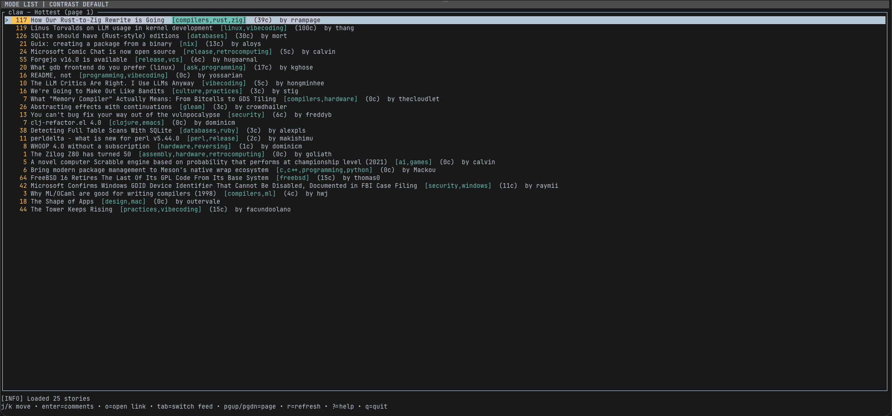
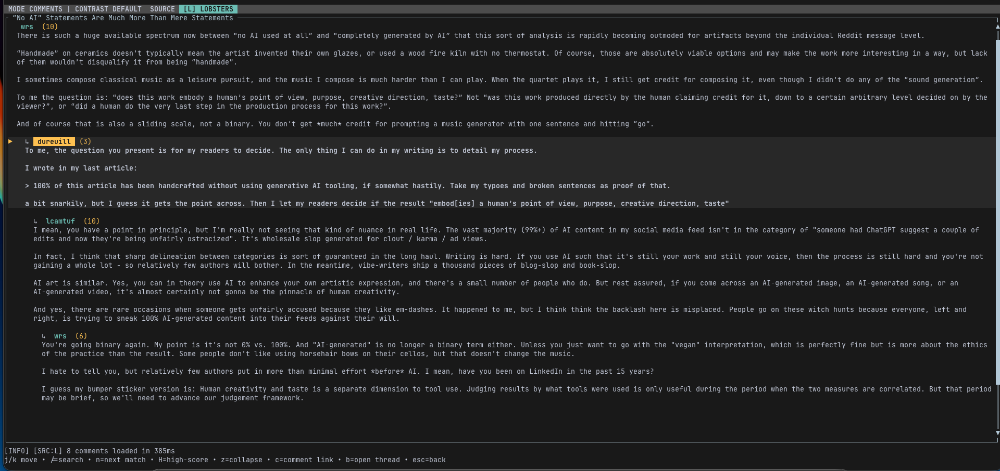

# pincer-cli

**A fast, keyboard-first terminal client for Lobsters + Hacker News.**

Browse stories, open links, read threaded comments, search discussions, and stay in your terminal.

## Screenshots

### Main page



### Comments view



---

## Features

- **Story feeds**: Lobsters (Hottest/Newest) + HN (Top/New)
- **Paging**: `[` / `]` or `PgUp` / `PgDn`
- **Threaded comments** with readable indentation + wrapping
- **Comment tools**: search (`/`), next match (`n`), collapse (`z`), high-score jump (`H`)
- **Open in browser**:
  - story link (`o`)
  - comments thread (`b`)
  - selected comment permalink (`c`)
- **Responsive UX**:
  - non-blocking comment loading
  - cached comment/story data + background page prefetch
  - clear status + recovery hints
  - help overlay (`?`)
- **Accessibility-minded UI**:
  - visible selected marker (`▶`) in comments
  - optional high-contrast mode
- **State persistence** across restarts (selection)
- **Explicit flow state machine** for list, comments, search, help, and quit

---

## Quick start

### Requirements

- Rust stable toolchain (1.70+ recommended)
- Cargo

### Run

```bash
cargo run
```

### Build release binary

```bash
cargo build --release
./target/release/pincer-cli
```

---

## Keybindings

### List view

- `j` / `k` or `↓` / `↑`: move selection
- `g` / `G`: top / bottom
- `Tab`: switch feed/source (Lobsters/HN variants)
- `r`: refresh current feed/page
- `[` / `]` or `PgUp` / `PgDn`: previous / next page
- `Enter`: open selected story comments
- `o`: open selected story URL in browser
- `b`: open selected story thread in its source site

### Comments view

- `j` / `k` or `↓` / `↑`: move selection
- `g` / `G`: top / bottom
- `/`: start search
- `n`: next search match
- `H`: jump to next high-score comment
- `z`: collapse/expand selected comment
- `c`: open selected comment permalink
- `Esc` or `Backspace`: back to list

### Global

- `?`: toggle help overlay
- `p`: toggle profiling info in status line
- `q`: quit

---

## Flow model

The app uses a small explicit state machine:

| State | Meaning |
|---|---|
| `List` | story feed browsing |
| `Comments` | story comments browsing |
| `SearchingComments` | in-comment search input |
| `Help*` | help overlay on top of the current base state |
| `Quitting` | terminal exit |

Transitions are intentionally simple:

- `List -> Comments` on `Enter`
- `Comments -> SearchingComments` on `/`
- `SearchingComments -> Comments` on `Enter` or `Esc`
- `Any -> Help(base)` on `?`
- `Help(base) -> base` on `?` or `Esc`
- `Help(base) -> Quitting` on `q`
- `Comments -> List` on `Esc` or `Backspace`
- `List -> Quitting` on `q`

Loading, refreshes, browser opens, and comment fetches are modeled as effects rather than state.

---

## Architecture

- `src/main.rs`: terminal loop, input handling, flow transitions, comments loader thread/channel, persistence load/save hooks.
- `src/app.rs`: app flow state machine, comments/wrap caches, search/collapse/profiling state, selection/navigation helpers.
- `src/api.rs`: Lobsters models + HTTP fetch, shared `OnceLock` client, timeout/retry logic, permalink builder.
- `src/state.rs`: persisted local state load/save (`selected`; startup defaults to Lobsters Hottest page 1).
- `src/ui.rs`: ratatui rendering for list/comments/status + help overlay.
- `tests/*.rs`: render-oriented regression tests via `ratatui::TestBackend`.

---

## Configuration

### Keymap preset

Set preset in `~/.config/pincer-cli/config.json`:

```json
{
  "keymap": "vim"
}
```

Supported values:
- `"vim"` (default)
- `"plain"`

You can also override by environment variable:

```bash
PINCER_KEYMAP=plain cargo run
```

### High contrast mode

```bash
PINCER_HIGH_CONTRAST=1 cargo run
```

---

## Data files

- App state: `~/.config/pincer-cli/state.json`
- Config: `~/.config/pincer-cli/config.json`

---

## Troubleshooting

- **I got stuck on an invalid page after restart**  
  Press `r`. If the saved page is unavailable, the app falls back to page 1 automatically.

- **No stories shown**  
  Check network access to Lobsters/Hacker News endpoints, then press `r`.

- **A browser action failed**  
  Confirm your OS has a default browser configured.

---

## Development

Run tests:

```bash
cargo test --quiet
```

Run the local quality/security loop:

```bash
./scripts/review-loop.sh
```

---

## License

MIT
