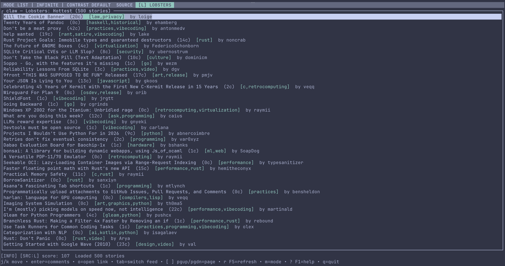

# pincer-cli

Terminal client for Lobsters and Hacker News.

Supports story listing, threaded comments, search, paging, and browser-open actions.

## Screenshots

### Main page


### Comments view


### Infinite mode



---

## Features

- **Story feeds**: Lobsters (Hottest/Newest) + HN (Top/New)
- **Paging**: `[` / `]` or `PgUp` / `PgDn`
- **Threaded comments** with readable indentation + wrapping
- **Comment tools**: search (`/`), next match (`n`), collapse (`z`), high-score jump (`H`)
- **Open in browser**:
  - story link (`o`)
  - comments thread (`b`)
  - selected comment permalink (`c`)
- **Performance behavior**:
  - non-blocking comment loading
  - progressive HN comment loading (quick preview, then full thread)
  - cached comment/story data + background page prefetch
  - clear status + recovery hints
  - help overlay (`?`)
- **Accessibility**:
  - visible selected marker (`▶`) in comments
  - source indicators include text tokens (`[L]` / `[H]` and `SRC:L` / `SRC:H`) so source does not rely on color
  - optional high-contrast mode
- **Startup defaults**: Lobsters Hottest, page 1 (configurable)
- **State persistence** across restarts (selection; optional feed/page restore)
- **Explicit flow state machine** for list, comments, search, help, and quit

---

## Quick start

### Requirements

- Rust stable toolchain (1.70+ recommended)
- Cargo

### Run

```bash
cargo run
```

### Build release binary

```bash
cargo build --release
./target/release/pincer-cli
```

---

## Keybindings

### List view

- `j` / `k` or `↓` / `↑`: move selection
- `g` / `G`: top / bottom
- `Tab`: switch feed/source (Lobsters/HN variants)
- `r`: refresh current feed/page
- `[` / `]` or `PgUp` / `PgDn`: previous / next page
- `Enter`: open selected story comments
- `o`: open selected story URL in browser
- `b`: open selected story thread in its source site

### Comments view

- `j` / `k` or `↓` / `↑`: move selection
- `g` / `G`: top / bottom
- `/`: start search
- `n`: next search match
- `H`: jump to next high-score comment
- `z`: collapse/expand selected comment
- `c`: open selected comment permalink
- `Esc` or `Backspace`: back to list

### Global

- `?`: toggle help overlay
- `p`: toggle profiling info in status line
- `q`: quit

---

## Flow model

The app uses a small explicit state machine:

| State | Meaning |
|---|---|
| `List` | story feed browsing |
| `Comments` | story comments browsing |
| `SearchingComments` | in-comment search input |
| `Help*` | help overlay on top of the current base state |
| `Quitting` | terminal exit |

Transitions are intentionally simple:

- `List -> Comments` on `Enter`
- `Comments -> SearchingComments` on `/`
- `SearchingComments -> Comments` on `Enter` or `Esc`
- `Any -> Help(base)` on `?`
- `Help(base) -> base` on `?` or `Esc`
- `Help(base) -> Quitting` on `q`
- `Comments -> List` on `Esc` or `Backspace`
- `List -> Quitting` on `q`

Loading, refreshes, browser opens, and comment fetches are modeled as effects rather than state.

---

## Architecture

- `src/main.rs`: terminal loop, input handling, flow transitions, comments loader thread/channel, persistence load/save hooks.
- `src/app.rs`: app flow state machine, comments/wrap caches, search/collapse/profiling state, selection/navigation helpers.
- `src/api.rs`: provider adapters for Lobsters + HN, shared `OnceLock` client, timeout/retry logic, and permalink helpers.
- `src/state.rs`: persisted local state load/save (`selected`; startup defaults to Lobsters Hottest page 1).
- `src/ui.rs`: ratatui rendering for list/comments/status + help overlay.
- `tests/*.rs`: render-oriented regression tests via `ratatui::TestBackend`.

---

## Configuration

### Keymap preset

Set preset in `~/.config/pincer-cli/config.json`:

```json
{
  "keymap": "vim",
  "startup": {
    "feed": "hottest",
    "page": 1,
    "restore_feed_page": false
  },
  "performance": {
    "prefetch_max_pages": 20,
    "hn_progressive_initial_comments": 10,
    "hn_progressive_step_comments": 20,
    "hn_comments_fetch_concurrency": 12
  },
  "network": {
    "connect_timeout_ms": 5000,
    "request_timeout_ms": 12000,
    "retry_attempts": 2,
    "retry_backoff_ms": 200
  },
  "ui": {
    "high_contrast": false
  }
}
```

Supported values:
- `"vim"` (default)
- `"plain"`
- `startup.feed`: `"hottest"`, `"newest"`, `"hn-top"`, `"hn-new"`

You can also override by environment variable:

```bash
PINCER_KEYMAP=plain cargo run
PINCER_STARTUP_FEED=hn-top PINCER_STARTUP_PAGE=1 cargo run
PINCER_STARTUP_RESTORE_FEED_PAGE=true cargo run
PINCER_PREFETCH_MAX_PAGES=30 cargo run
PINCER_HN_PROGRESSIVE_INITIAL_COMMENTS=12 PINCER_HN_PROGRESSIVE_STEP_COMMENTS=24 cargo run
PINCER_HN_COMMENTS_FETCH_CONCURRENCY=16 cargo run
PINCER_HTTP_CONNECT_TIMEOUT_MS=3000 PINCER_HTTP_REQUEST_TIMEOUT_MS=15000 cargo run
PINCER_HTTP_RETRY_ATTEMPTS=3 PINCER_HTTP_RETRY_BACKOFF_MS=250 cargo run
```

### High contrast mode

```bash
PINCER_HIGH_CONTRAST=1 cargo run
```

---

## Data files

- App state: `~/.config/pincer-cli/state.json`
- Config: `~/.config/pincer-cli/config.json`

---

## Troubleshooting

- **I got stuck on an invalid page after restart**  
  Out-of-range pages fall back to page 1 automatically.

- **No stories shown**  
  Check network access to Lobsters/Hacker News endpoints, then press `r`.

- **A browser action failed**  
  Confirm your OS has a default browser configured.

---

## Development

Run tests:

```bash
cargo test --quiet
```

Run the local quality/security loop:

```bash
./scripts/review-loop.sh
```

## Project policies

- Contributing: `CONTRIBUTING.md`
- Code of Conduct: `CODE_OF_CONDUCT.md`
- Security policy: `SECURITY.md`
- Support: `SUPPORT.md`

---

## License

Licensed under either:

- MIT (`LICENSE-MIT`)
- Apache-2.0 (`LICENSE-APACHE`)
